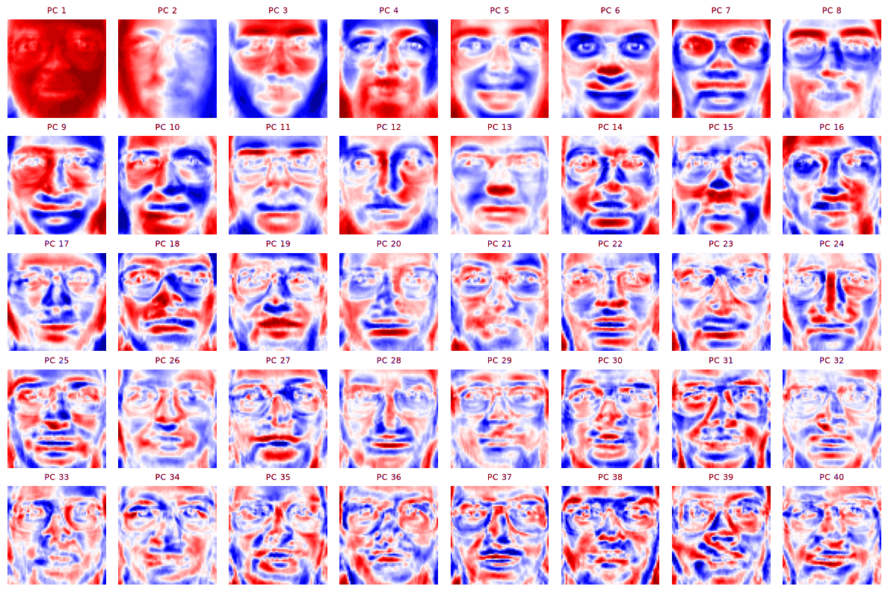
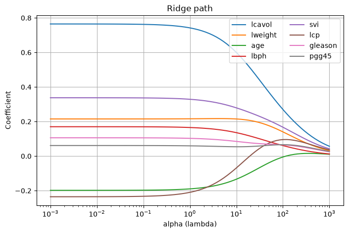
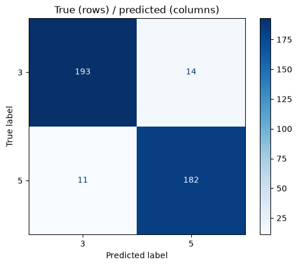
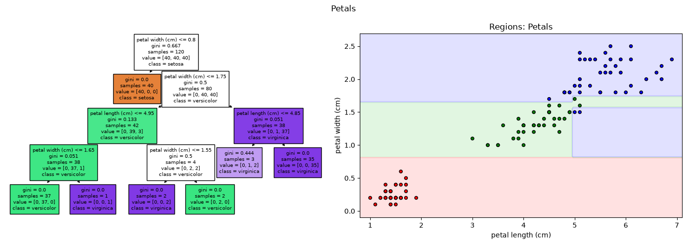
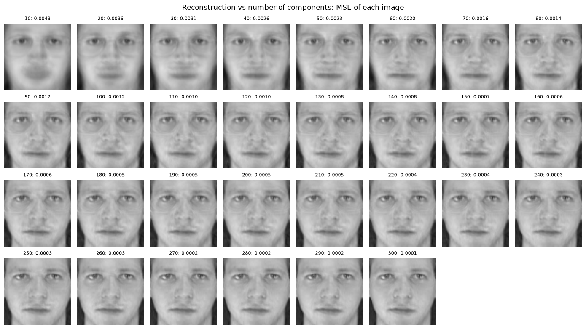

# Decision and machine learning: regression, classification, trees and PCA

Four labs from the Decision and Machine Learning course at Centrale Lille, covering the core supervised and unsupervised methods with scikit-learn, each checked against the closed-form solution from the lecture when one exists.



## Highlights

- **Linear, ridge and LASSO regression** on the prostate cancer dataset: scikit-learn coefficients matched to the closed-form solutions, regularization paths, and λ chosen by 5-fold cross-validation (test MSE 0.522 vs 0.540 without regularization).
- **Classification of handwritten 3s and 5s** (MNIST): logistic regression at 93.8% test accuracy, precision-recall trade-off along the decision threshold, and KNN with k chosen by cross-validation at **97.0%**.
- **Decision trees and random forests** on Fisher's iris: tree interpretation, decision regions (petals 96.7% vs sepals 60.0%), out-of-bag error and feature importances.
- **PCA on the Olivetti faces**: 123 components explain 95% of the variance of 4,096 pixels; eigenfaces, reconstruction quality, and a cross-validated comparison showing that 50 components keep 96.3% accuracy with a 6 times faster fit.

## Contents

| Lab | Topic | Main concepts |
|---|---|---|
| [Lab 1](lab1/lab1.ipynb) | Linear regression | least squares, standardization, ridge, cross-validation, LASSO (bonus) |
| [Lab 2](lab2/lab2.ipynb) | Classification | logistic regression, confusion matrix, precision and recall, decision threshold, KNN |
| [Lab 3](lab3/lab3.ipynb) | Trees and forests | decision trees, decision regions, regularization, random forests, OOB error, feature importance |
| [Lab 4](lab4/lab4.ipynb) | PCA | explained variance, eigenfaces, dimensionality reduction for classification, reconstruction |

## Repository layout

```text
.
├── lab1/
│   ├── lab1.ipynb
│   └── data_X.npy, data_y.npy    # prostate cancer data (Stamey et al., 1989)
├── lab2/
│   ├── lab2.ipynb
│   └── data3.npy, data5.npy      # MNIST images of 3s and 5s
├── lab3/lab3.ipynb               # iris (loaded from scikit-learn)
├── lab4/lab4.ipynb               # Olivetti faces (downloaded by scikit-learn on first run)
├── docs/                         # Figures used in this README
└── requirements.txt
```

## Run it

```bash
pip install -r requirements.txt
jupyter notebook lab1/lab1.ipynb
```

Open each notebook from its own folder and run the cells in order. All outputs and figures are saved, so the notebooks can be read without running them.

## Context

Coursework for the Decision and Machine Learning course, Centrale Lille. The lab statements were provided by the teaching staff; the answers, code and analysis are my own. More on my [portfolio](https://ugo-roccamatisi.github.io).

## Gallery

| | |
|---|---|
|  |  |
|  |  |
